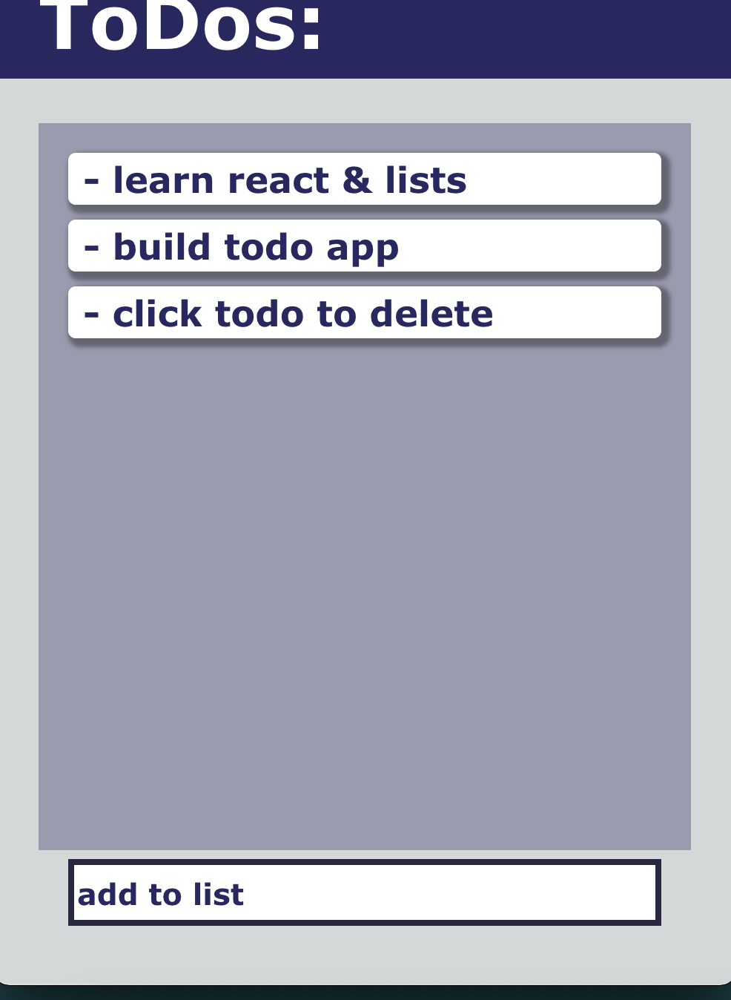
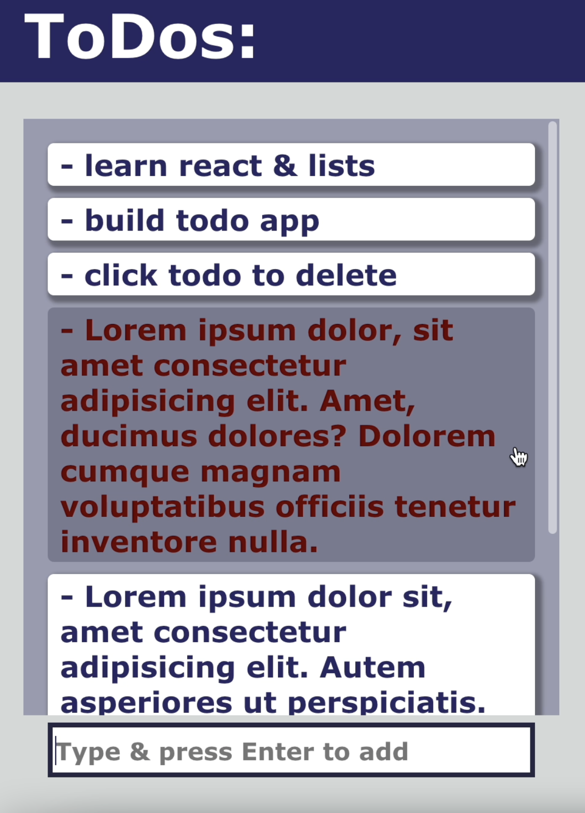

# Todo List

---

## **Description**

An interactive to-do list using React and Formik.

---

## **How to run**

**Add listing**: Type into the bottom input field.

Press enter to add to list.

**Remove listing**: Hovering over the listing will change the styling.

Click on listing to delete.

**Scroll through list**: The listings are contained inside the `todo-list`. You can scroll through the list within the `
`.

---

## **Road Map**

1. Add checkboxes to show completed todos.
2. Add button to delete completed.
3. Create a local storage so that changes are kept.

---

## **Licenses**

- MIT
- Custom styling and code using HTML, CSS, JavaScript and React.
